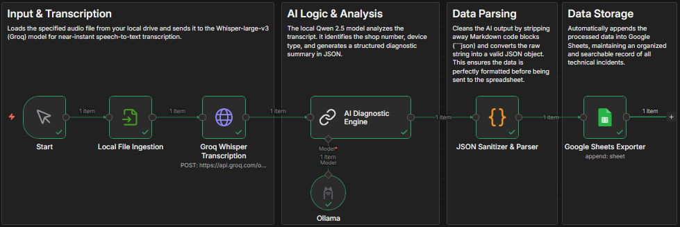

# 🧾 Voice Transcription (PL) for helpdesk - AI Diagnostic Assistant

## 🖼️ Workflow Preview
 
*Visual representation of the n8n nodes and logic.*

An intelligent pipeline designed to transcribe technical support calls and automatically extract diagnostic data into a structured registry.

## 🎯 Why This Project?
I created **AI Diagnostic Assistant** because I work in a **helpdesk environment** myself. I realized how much time is wasted on "boring" administrative tasks. I created this tool to:
- **Eliminate Manual Work:** No more tedious manual writing of diagnostics after every call.
- **Data Accuracy:** Automatically extracting shop numbers and device types ensures nothing gets lost in translation.
- **Efficiency:** Turning a 5-minute recording into a structured database entry in seconds.

## 🛠️ Tech Stack
- **Orchestration:** [n8n](https://n8n.io/)
- **Transcription:** **Whisper-large-v3** via **Groq API** (insanely fast STT).
- **AI Analysis:** **Qwen 2.5** (optimized for Polish context) via **Ollama**.
- **Storage:** Google Sheets API.

## 🔄 How it Works
1. **Local Ingestion:** The workflow reads an audio file from a local directory.
2. **Transcription:** The audio is sent to Groq, which returns a full text transcript in seconds.
3. **AI Logic:** The **AI Diagnostic Engine** (Qwen) analyzes the text to identify the store number, the faulty device, and the resolution (e.g., remote reset vs. technician visit).
4. **JSON Sanitization:** A custom JavaScript node cleans the AI output to ensure perfect data formatting.
5. **Auto-Logging:** The structured data is appended to a **Google Sheets** document, creating an instant incident log.

## ⚠️ Evolution & Current Status
Originally, this workflow featured a **Local File Trigger** that automatically monitored a folder for new recordings. However, following a recent n8n update, the node supporting this "watch" functionality was removed. 

**Current state:** The project is a stable **MVP** that processes specific files manually. I am currently researching workarounds (like Python-based watchers or webhooks) to bring back 100% automation.

## 🚀 Setup
1. **Ollama:** Run `ollama run qwen2.5:7b` (or your preferred Polish-capable model).
2. **Groq API:** Get your API key from [Groq Console](https://console.groq.com/).
3. **Google Sheets:** Set up a sheet with headers: `Nr_sklepu`, `Urządzenie`, `Problem`, `Status`, `Notatka`.
4. **Import:** Import the `workflow.json` into n8n and update the file paths.

---
*Created to bridge the gap between technical support and AI efficiency.*